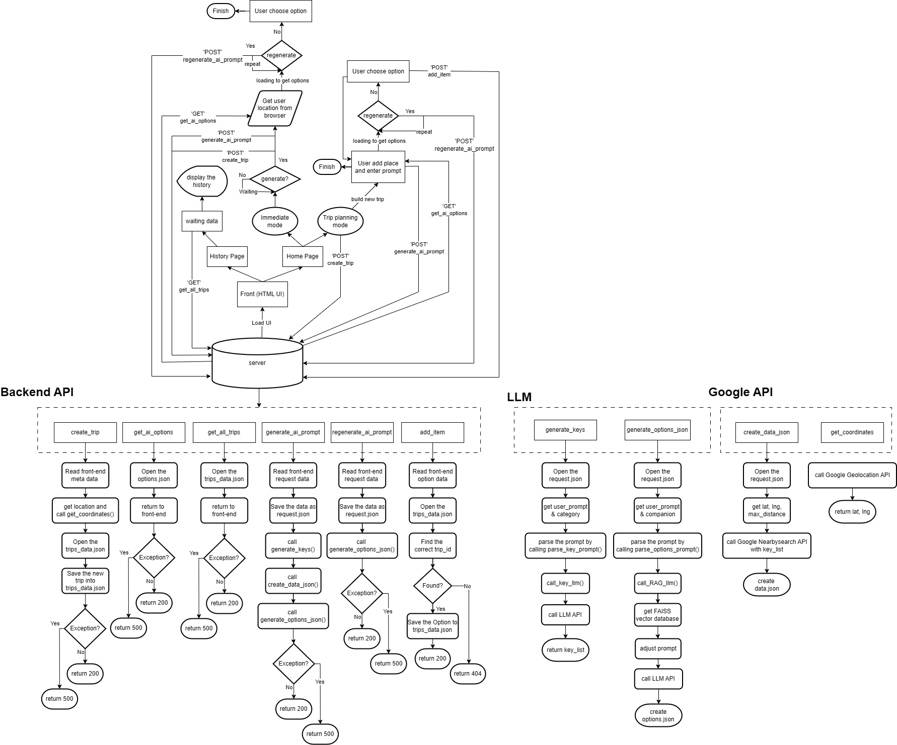

# Guide RAG AI Agent

## Description
This web application helps users plan trips by generating personalized
location suggestions based on their preferences.

It leverages a large language model (LLM) powered by Ollama to generate
location-related keywords, and integrates FAISS to build a retrieval-augmented
generation (RAG) knowledge base. 

By combining the Google Places API and
Google Geolocation API, the system ensures that recommended locations are
relevant, accurate, and aligned with real-world geographic data.Location keywords are generated using Ollama (LLM).

 Simultaneously, LLM is combined with FAISS to store vector data, enabling the creation of RAG AI reference data.Connect the Google Place API and Google Geolocation API to ensure that recommended locations meet user requirements.

## Features

### 🧭 Personalized Location Generation
- Users can generate locations by providing customized preferences, including:
  - Location type (e.g., food, attractions, entertainment)
  - Distance constraints
  - Companion type (solo, friends, family, couple, etc.)
  - Additional requirements via a free-text prompt input

### 🤖 AI-Powered Keyword & Location Discovery
- An LLM powered by Ollama generates **three location-related keywords**
  based on user input.
- The generated keywords are sent to the Google Places API to retrieve
  a list of relevant real-world locations.

### 🧠 RAG-Based Intelligent Recommendation
- A Guide RAG AI module filters and ranks candidate locations by combining:
  - FAISS-based vector similarity search
  - LLM reasoning
  - Online contextual information
- The system selects the **top 5 most suitable locations** for recommendation.

### 🔁 Regeneration & Prompt Refinement
- If users are not satisfied with the initial recommendations, they can:
  - Regenerate a **new set of five different locations**
  - Add or refine prompts to further guide the AI
- Each regeneration produces diversified results while preserving
  user constraints and context.

### 📍 Rich Location Recommendation Cards
Each recommended location includes:
- Location name
- Distance from the user
- Star rating
- Three AI-generated descriptive tags
- An AI-generated recommendation summary tailored to the user’s preferences

### 🔄 Iterative Location Expansion
- Users can continue generating and selecting additional locations through
  multiple refinement cycles.
- The system dynamically adapts recommendations based on previously
  selected locations.

### 🗺️ Full-Day Trip Itinerary Creation
- Selected locations are assembled into a complete one-day itinerary.
- The itinerary is presented in an organized and user-friendly layout,
  supporting step-by-step trip planning.


## System Workflow



## Tech Stack

- LLM Backend: Ollama ( gemma3:4b & gpt-oss:120b)
- Embedding Model: `google/embeddinggemma-300m` (Hugging Face)
- Vector Database: FAISS
- External APIs:
  - Google Places API
  - Google Geolocation API
- Backend: Python (Flask / FastAPI)
- Frontend: Web-based UI


## Prerequisites

Before installing the project, make sure you have the following installed or prepared on your system:

- Python 3.12+
- Git
- pip
- Ollama (running locally for LLM inference)
- Google API Key (Places API & Geolocation API enabled)
- Hugging Face Access Token

## Installation & Environment

### Steps


#### 1. Clone the repository
```bash
git clone https://github.com/RuQian5757/TOS_final_project.git
cd TOS_final_project
```

#### 2. Set up environment variables

This project requires the following environment variables:

- `LLM_API_KEY`
- `GOOGLE_API_KEY`: [guideline](#google-api-key)
- `HUGGING_FACE_TOKEN`: [guideline](#hugging-face-access-token)

##### Windows (PowerShell / Command Prompt)
```bash
setx LLM_API_KEY "YOUR_API_KEY"
setx GOOGLE_API_KEY "YOUR_API_KEY"
setx HUGGING_FACE_TOKEN "YOUR_HF_TOKEN"

⚠️ Please restart the terminal after running setx to ensure the environment variables are applied.
```
#### 3. Create a virtual environment
```bash
python -m venv venv
```
#### 4. Activate the virtual environment
##### PowerShell:
```bash
.\venv\Scripts\Activate.ps1
```
If you encounter an execution policy error, run:
```bash
Set-ExecutionPolicy -Scope CurrentUser -ExecutionPolicy RemoteSigned
```
Then activate the virtual environment again.
##### Command Prompt (cmd):
```bash
.\venv\Scripts\Activate.bat
```
#### 5. Install dependencies
```bash
python -X utf8 -m pip install -r requirements.txt
```

## API Keys & Tokens Setup

### Google API Key

This project uses:
- Google Places API
- Google Geolocation API

To obtain your Google API Key:

1. Go to the [Google Cloud Console](https://console.cloud.google.com/).
2. Create a new project or select an existing one.
3. Navigate to **APIs & Services → Library** and enable:
   - **Places API**
   - **Geolocation API**
4. Go to **APIs & Services → Credentials → Create Credentials → API Key**.
5. Copy the generated API Key and set it as an environment variable

---

### Hugging Face Access Token
This project uses:
- `google/embeddinggemma-300m`

To obtain your Huggin Face Token:

1. Go to the [Hugging Face](https://huggingface.co/)
2. Sign up an account
3. Go to [google/embeddinggemma-300m](https://huggingface.co/google/embeddinggemma-300m) and press Acknowlege license
4. Go to Setting/Access Token
5. Create new token with read permission
6. Copy the generated Token and set it as an environment variable

The FAISS vector database is built using the
`google/embeddinggemma-300m` embedding model from Hugging Face.


## RAG Data Preparation

This project supports custom reference data for RAG-based reasoning.

### Supported File Formats
- `.pdf`
- `.docx`
- `.txt`

### Steps to Build the FAISS Vector Database

1. Place your reference documents into the `/vector_dataset/uploaded_files` directory.
2. Run the following command to generate the FAISS vector database

```bash
python ./vector_dataset/createDB.py
```
- The generated FAISS database will be stored locally and loaded
automatically by the main application.


## Usage
### Step 1: Build FAISS Vector Database
Follow the [reference](#rag-data-preparation)
### Step 2: Run the Web Application
```bash
python /server/app.py
```
You should see output indicating the server is running, for example:
```bash
 * Running on http://127.0.0.1:5000
```
### Step 3: Open the Web Interface in Browser
1. Open your preferred web browser (e.g., Chrome).
2. Navigate to: http://127.0.0.1:5000